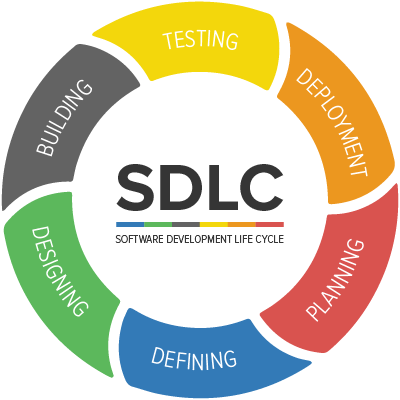

DATA APPLICATIONS

## **Overview**
This repo contains various data driven applications I have built over time. In addition, some applications maybe part of a group project during one of the many courses I had enrolled in. Organization of content helps me to document, my passion for building data driven application and any learnings I have garnered along the way. 

Everythng built is in the spirit of open source so feel free to use and star the repo if beneficical :). Applications are built based on specific AI techniques, domain knowledge, niche use cases, use of open source programming libraries, and distributed applications. All this is built using various open source technologies

# **Table Of Contents**
1. [AI Techniques]()
2. [Domain specific]()
3. [Niche use cases]()
4. [Distributed applications]()
5. [Open source libraries]()

# AI Techniques
### **Machine Learning**
1. [TBD]()

### **Deep Learning**
1. [TBD]()

### **Reinforcement Learning**
1. [TBD]()

### **Natural Language Processing**
1. [TBD]()
2. [TBD]()

### **Computer Vision**
1. [TBD]()
2. [TBD]()

# Domain Specific
### **Fintech**
1. [TBD]()

### **Martech**
1. [TBD]()

# Niche applications
1. [Recommender engine]()
2. [Self driving]()
3. [Streamlit app]()

# Distributed applications
1. [TBD]()
2. [TBD]()

# Usage of Libraries
1. [TBD]()

